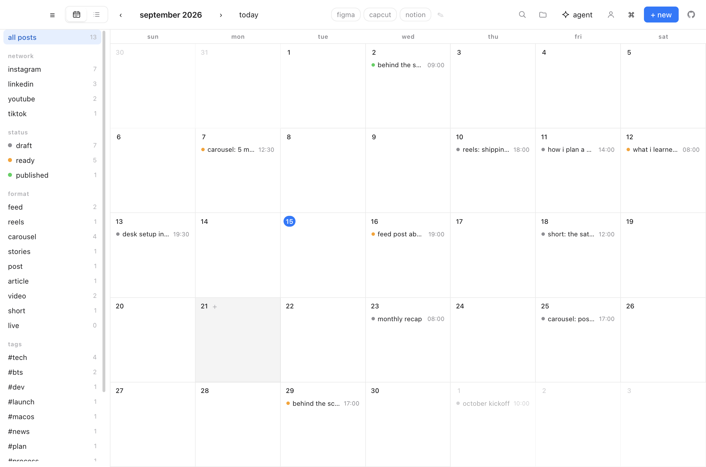
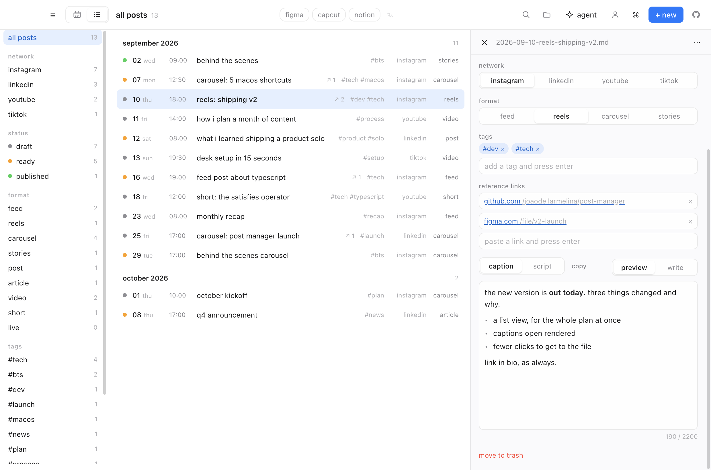
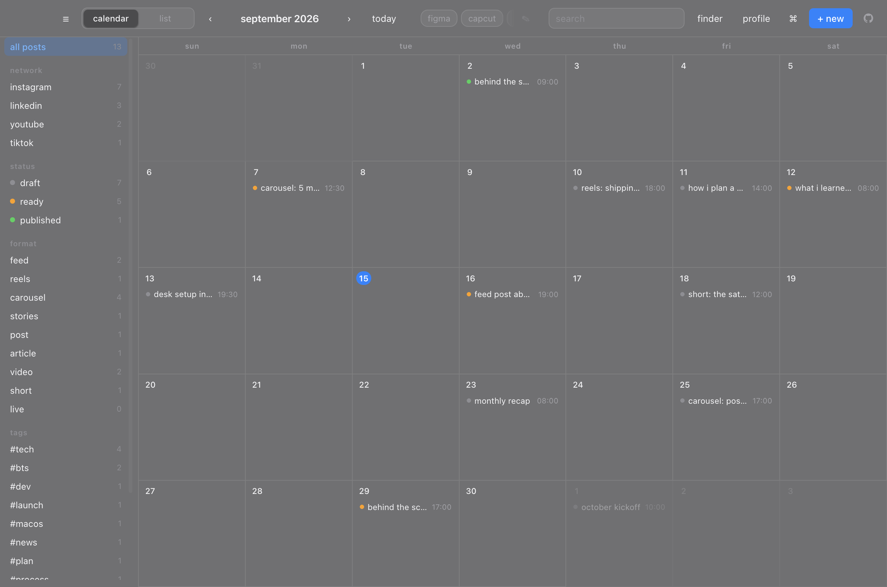
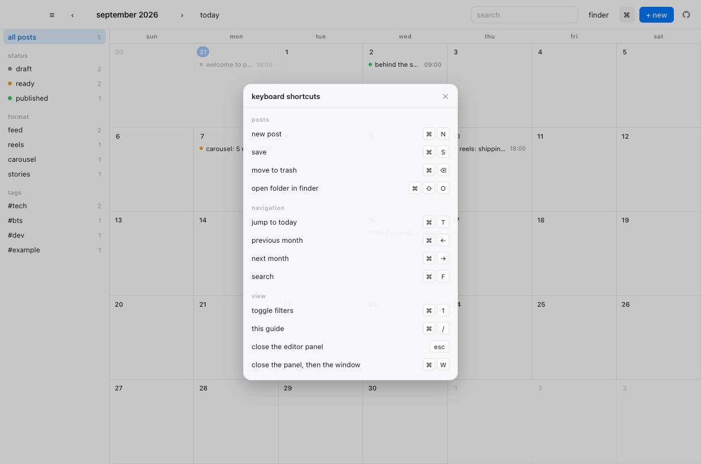

<p align="center">
  
</p>

<h1 align="center">hi, this is post manager</h1>

<p align="center">
  a simple, open-source mac app to plan your posts.<br>
  every post is a plain markdown file in <code>~/Documents/post-manager/</code>.
</p>

<p align="center">
  <a href="https://github.com/joaodellarmelina/post-manager/releases/latest">
    <b>download latest version here</b>
  </a>
</p>

<p align="center">
  
</p>

## why

your posts are just files. no database, no account, no sync, no lock-in.
open the same folder in obsidian, ia writer or vim — the app picks up your
edits instantly. delete the app and your work is still there.

## what a post looks like

filename is `YYYY-MM-DD-slug.md`, generated from the date and title.

```yaml
---
title: 'reels: shipping v2'
date: '2026-09-10'
time: '18:00'
status: draft        # draft | ready | published
type: reels          # feed | reels | carousel | stories
tags: ['#dev', '#tech']
links:               # reference links, as many as you want
  - 'https://github.com/joaodellarmelina/post-manager'
  - 'https://www.figma.com/file/v2-launch'
---
the new version is **out today**. three things changed and why.
```

change the date or title and the file gets renamed for you — no duplicates.
break the yaml and the app flags that one post in red instead of falling over.

## write in markdown, see it rendered

<p align="center">
  
</p>

captions support headings, bold, italic, strikethrough, code, links, lists and
quotes, with a live preview and the 2,200 character instagram limit in view.

each post also keeps a list of **reference links** — the article you're reacting
to, the figma file, the doc you're citing. paste a url, hit enter, click it later
to open it in your browser.

<p align="center">
  
</p>

## shortcuts

| | |
|---|---|
| `⌘N` | new post |
| `⌘S` | save (it also autosaves) |
| `⌘W` | close the editor panel, or the window |
| `Esc` | close the editor panel |
| `⌘T` | jump to today |
| `⌘←` `⌘→` | previous / next month |
| `⌘F` | search |
| `⌘1` | toggle filters |
| `⌘/` | this shortcuts guide |
| `⌘⌫` | move post to trash |
| `⌘⇧O` | open the folder in finder |

press `⌘/` or click the `⌘` button in the toolbar to see them in the app.

<p align="center">
  
</p>

## run it yourself

```sh
git clone https://github.com/joaodellarmelina/post-manager.git
cd post-manager
npm install
npm run dev
```

that's it -- you're up and running.

## build a .dmg

```sh
npm run dist
```

output lands in `release/`.

## first launch

builds are ad-hoc signed but **not notarised** — notarising needs a paid apple
developer account. so macOS quarantines the download and shows either
*"apple could not verify post manager is free of malware"* or, on older builds,
*"post manager is damaged"*.

drag the app to Applications first, then run:

```sh
xattr -dr com.apple.quarantine '/Applications/post manager.app'
```

it opens normally after that. if you'd rather not use the terminal, try to open
it once, then go to **system settings → privacy & security** and click
**open anyway** next to the blocked app. (control-click → open no longer works
for this on macOS 15 and later — apple moved the bypass into system settings.)

none of this means the app is doing anything to your machine: it's the standard
warning for any mac app distributed outside the app store without a paid
developer account. you can read every line of what you're running in this repo,
or build it yourself with `npm run dist`.

if you wanna make an addition + pr, or just wanna remix the app for yourself,
go for it. open a pr and i'll run it on my end and build a new version :)

## how it works

```
electron/main.js      window, app:// protocol, menu, folder watcher
electron/preload.js   contextBridge → window.vault (the only exposed surface)
electron/posts.js     fs/promises + gray-matter
src/                  expo / react-native-web ui
```

a few things worth knowing if you're poking around:

- **`app://` instead of `file://`** — `expo export` emits absolute asset paths that
  break under `file://`. a custom standard scheme fixes it and works inside `app.asar`.
- **`main` in package.json is `index.ts`** (metro's entry). electron uses
  `build.extraMetadata.main` to point at `electron/main.js` in the packaged app.
- **only `gray-matter` is a runtime dependency.** expo, react and react-native are
  devDependencies since the bundle ships compiled — that takes the .app from 504 MB to 288 MB.
- **the theme comes from one `ThemeContext` at the root.** calling `useColorScheme()`
  per cell left subtrees with stale colours when the system appearance changed.
- **markdown is rendered from tokens, never html.** post bodies come from files anything
  can write, and the renderer can reach `window.vault`, so injection is impossible by
  construction rather than sanitized after the fact.
- **writes are atomic** (temp file + rename) and deletes go to the trash, never `unlink`.
- **the app is ad-hoc signed in `afterPack`.** electron ships binaries with a
  linker-signed signature whose identifier is literally `Electron`; adding files and
  editing Info.plist invalidates it, and macOS reports an invalid signature as
  "app is damaged and can't be opened".
- **the icon needs an asset catalog**, not just an `.icns` — macOS 26 draws a legacy
  icns onto a system plate, which would nest the artwork's squircle inside a second one.
  regenerate it with `npm run icon` (needs xcode).

## license

mit
