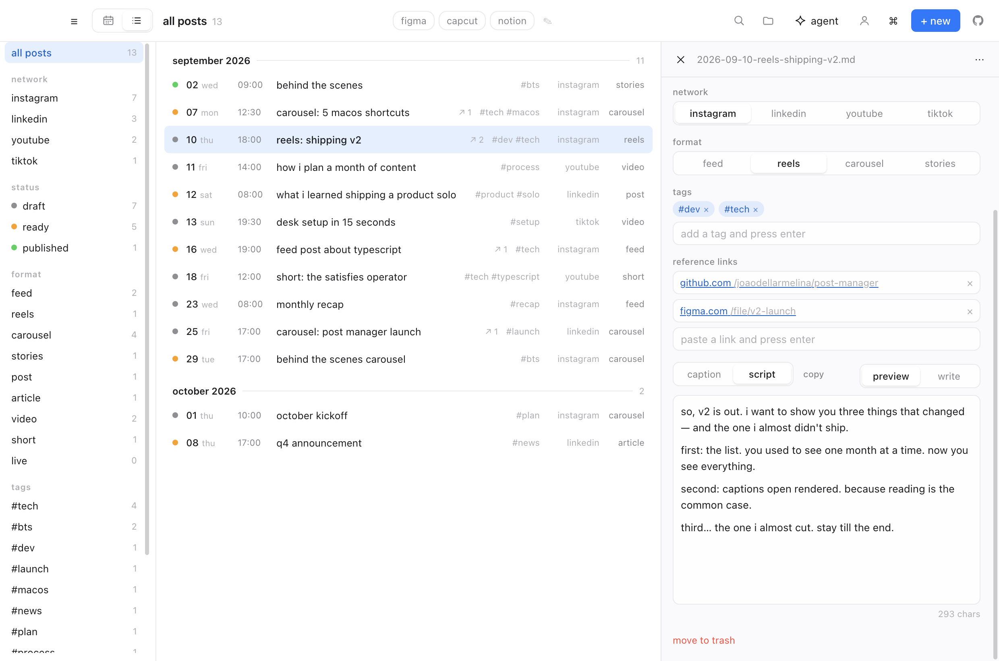
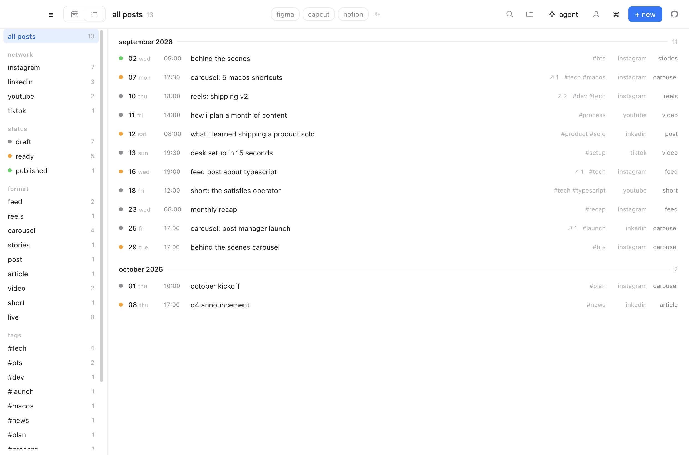
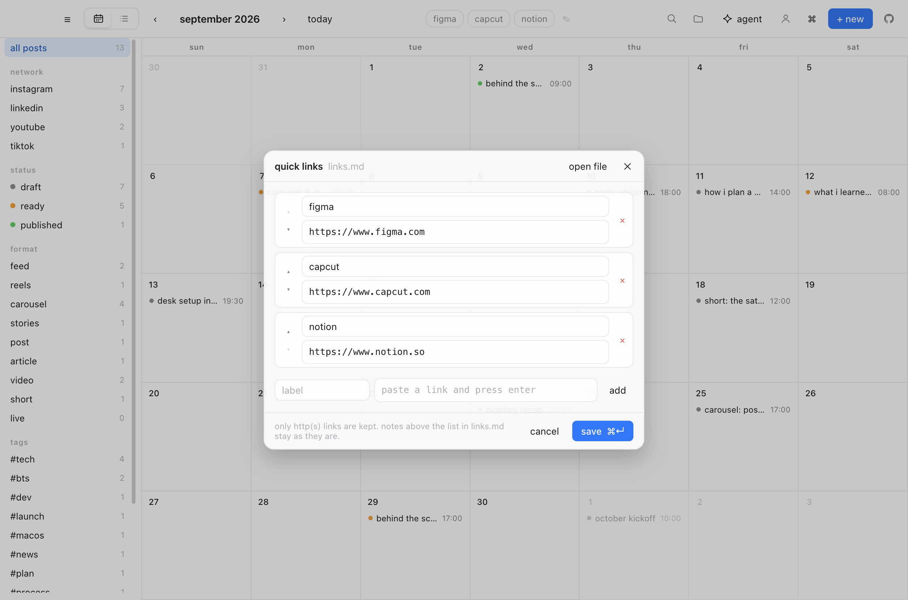
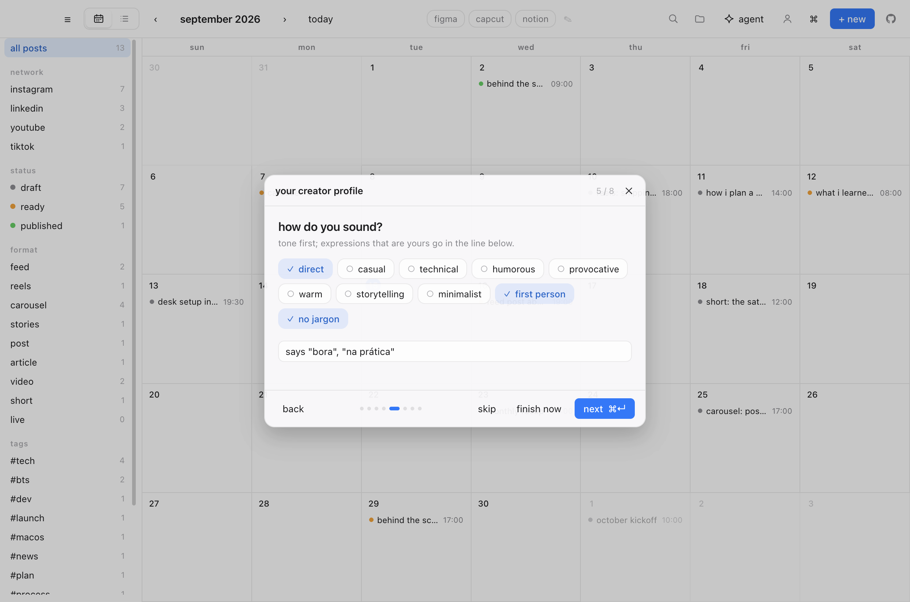
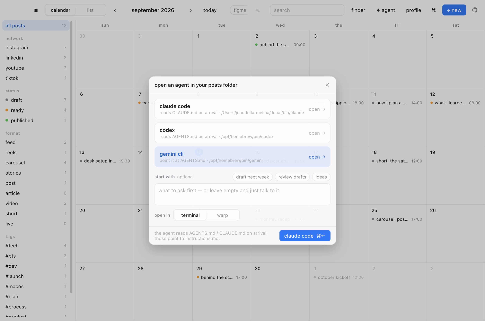
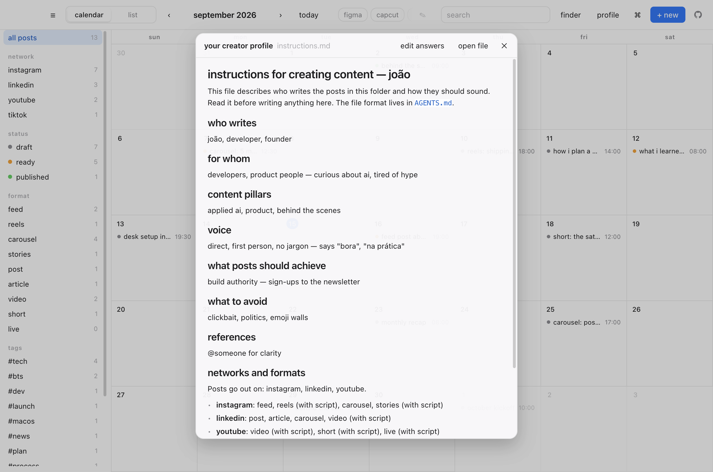

<p align="center">
  
</p>

<h1 align="center">hi, this is post manager</h1>

<p align="center">
  a simple, open-source mac app to plan your posts.<br>
  every post is a plain markdown file in <code>~/Documents/post-manager/</code>.
</p>

<p align="center">
  <a href="https://github.com/joaodellarmelina/post-manager/releases/latest">
    <b>download latest version here</b>
  </a>
  &nbsp;·&nbsp;
  <a href="CHANGELOG.md">changelog</a>
</p>

<p align="center">
  
</p>

## why

your posts are just files. no database, no account, no sync, no lock-in.
open the same folder in obsidian, ia writer or vim — the app picks up your
edits instantly. delete the app and your work is still there.

and because they are files, an agent can work in the same folder as you: the
app writes `AGENTS.md` and `CLAUDE.md` describing the format, and a short
onboarding writes `instructions.md` describing *you* — so "draft three reels
for next week" is a one-line prompt, not a briefing.

## what it does

- **calendar and list** of every post, filtered by network, status, format and tag
- **one network per post** — instagram, linkedin, youtube or tiktok — with the
  formats each one actually publishes
- **markdown captions, rendered**, with a **script** next to them for video formats
- **copy as plain text** for a teleprompter or the network's caption field
- **reference links** on each post, and **quick links** to your tools in the toolbar
- **onboarding → `instructions.md`**, plus `AGENTS.md` / `CLAUDE.md`, so any agent
  that opens the folder knows who you are and how the files work
- keyboard shortcuts for everything, dark mode, and a folder watcher that picks
  up edits made anywhere else

## what a post looks like

filename is `YYYY-MM-DD-slug.md`, generated from the date and title.

```yaml
---
title: 'reels: shipping v2'
date: '2026-09-10'
time: '18:00'
status: draft        # draft | ready | published
network: instagram   # instagram | linkedin | youtube | tiktok
type: reels          # depends on the network, see below
tags: ['#dev', '#tech']
links:               # reference links, as many as you want
  - 'https://github.com/joaodellarmelina/post-manager'
  - 'https://www.figma.com/file/v2-launch'
---
the new version is **out today**. three things changed and why.

## script

hey — so v2 is out. let me show you the three things that changed…
```

change the date or title and the file gets renamed for you — no duplicates.
break the yaml and the app flags that one post in red instead of falling over.
a post without `network:` is treated as instagram, which is what the app used to assume.

## one post, one network

each post targets a single network, and the format list follows it:

| network | formats | has a script |
|---|---|---|
| instagram | feed · reels · carousel · stories | reels, stories |
| linkedin | post · article · carousel · video | video |
| youtube | video · short · live | all |
| tiktok | video · carousel · live | video, live |

the sidebar filters by network, and the format filter narrows to that network's
formats. on youtube the post title is the video title (with the 100 character
count in view) and your tags double as the video's tags.

video formats carry a **script** next to the caption — the thing you read on
camera. it lives in the same file, after a `## script` heading, so it reads
naturally in any editor. in the app, switch between `caption` and `script`
above the text; `copy` sends whichever you're looking at to the clipboard as
plain text, ready for a teleprompter.

<p align="center">
  
</p>

## two ways to look at the plan

the calendar is for spotting gaps in a month. the list is for working through
everything in order, across months — switch with the toggle in the toolbar or `⌘L`.

<p align="center">
  
</p>

each row carries the status dot, date, time, title, how many reference links it
has and its format. the filters and the search box apply to both views, and
clicking a row opens the same editor.

## write in markdown, see it rendered

<p align="center">
  
</p>

captions and scripts support headings, bold, italic, strikethrough, code, links,
lists and quotes, with the 2,200 character instagram limit in view for captions.

a post with a caption **opens rendered** — reading it is the common case, and
markup is noise when you just want to reread your copy. switch to `write` to
edit; a post with nothing in it yet opens ready to type.

each post also keeps a list of **reference links** — the article you're reacting
to, the figma file, the doc you're citing. paste a url, hit enter, click it later
to open it in your browser.

<p align="center">
  
</p>

## quick links to your tools

the toolbar carries shortcuts to whatever sits around your writing — figma,
capcut, the network itself. they come from `links.md` in the same folder as
your posts, one markdown link per line:

```markdown
- [figma](https://www.figma.com)
- [capcut](https://www.capcut.com)
```

the file is created with a few examples on first launch. the pencil in the
toolbar (or `⌘⇧L`) opens a small editor in the app — add, rename, reorder,
remove — that writes the list back; `open file` there gets you the markdown if
you'd rather. edit it anywhere else and the toolbar follows. only `http(s)`
links are picked up, so notes above the list are kept as they are.

<p align="center">
  
</p>

## agents friendly

the folder is meant to be handed to an agent — codex, claude code, whatever you
use — with no explanation. the first launch asks eight direct questions (who you
are, who you write for, your pillars, your voice, your goal, what to avoid, your
references, language and networks) and writes three files next to your posts:

- **`instructions.md`** — your creator profile as a prompt, in the language you
  post in. the answers sit in its frontmatter, so redoing the onboarding starts
  from them.
- **`AGENTS.md`** and **`CLAUDE.md`** — the same short contract for the folder:
  file naming, the frontmatter, formats per network, the `## script` separator,
  and the rules (one post per file, new posts are drafts, never invent facts).

<p align="center">
  
</p>

then press **`✦ agent`** in the toolbar (or `⌘⇧A`): pick claude code, codex or
gemini cli, optionally a starter prompt — *draft next week*, *review drafts*,
*ideas* — and it opens a terminal already inside `~/Documents/post-manager` with
the agent running. claude code reads `CLAUDE.md` on arrival and codex reads
`AGENTS.md`; both point to `instructions.md`. type what you want:

```
draft three reels for next week about the second pillar. one file each, status draft.
```

the app picks the new files up instantly — that's the whole loop.

<p align="center">
  
</p>

under the hood it writes a small `.command` file and opens it with Terminal.app
(or a launch configuration for warp, if you have it) — no automation permissions,
no apple events. the file hands off to your own shell as a login shell, so
whatever `.zshrc`, `.bashrc` or `config.fish` puts on your PATH is there. it is a terminal rather than the claude or codex desktop app
because neither exposes an "open this folder" url; the CLIs are also where those
context files are read automatically. agents that aren't installed show the
install command instead. the `profile` button in the toolbar
(or `⌘⇧P`) shows `instructions.md` rendered, with `edit answers` to redo the
onboarding from your previous answers — or `⌘⇧I` goes straight there. none of
the questions is required.

<p align="center">
  
</p>

## shortcuts

| | |
|---|---|
| `⌘N` | new post |
| `⌘S` | save (it also autosaves) |
| `⌘W` | close the editor panel, or the window |
| `Esc` | close the editor panel |
| `⌘T` | jump to today |
| `⌘←` `⌘→` | previous / next month |
| `⌘F` | search — opens the box; it stays open while there is a query |
| `⌘L` | switch calendar / list |
| `⌘1` | toggle filters |
| `⌘/` | this shortcuts guide |
| `⌘⌫` | move post to trash |
| `⌘⇧O` | open the folder in finder |
| `⌘⇧L` | edit the quick links |
| `⌘⇧P` | read your creator profile |
| `⌘⇧I` | redo the onboarding |
| `⌘⇧A` | open an agent in the folder |

press `⌘/` or click the `⌘` button in the toolbar to see them in the app.

<p align="center">
  
</p>

## run it yourself

```sh
git clone https://github.com/joaodellarmelina/post-manager.git
cd post-manager
npm install
npm run dev
```

that's it -- you're up and running.

## build a .dmg

```sh
npm run dist
```

output lands in `release/`.

## first launch

builds are ad-hoc signed but **not notarised** — notarising needs a paid apple
developer account. so macOS quarantines the download and shows either
*"apple could not verify post manager is free of malware"* or, on older builds,
*"post manager is damaged"*.

drag the app to Applications first, then run:

```sh
xattr -dr com.apple.quarantine '/Applications/post manager.app'
```

it opens normally after that. if you'd rather not use the terminal, try to open
it once, then go to **system settings → privacy & security** and click
**open anyway** next to the blocked app. (control-click → open no longer works
for this on macOS 15 and later — apple moved the bypass into system settings.)

none of this means the app is doing anything to your machine: it's the standard
warning for any mac app distributed outside the app store without a paid
developer account. you can read every line of what you're running in this repo,
or build it yourself with `npm run dist`.

if you wanna make an addition + pr, or just wanna remix the app for yourself,
go for it. open a pr and i'll run it on my end and build a new version :)

## how it works

```
electron/main.js      window, app:// protocol, menu, folder watcher
electron/preload.js   contextBridge → window.vault (the only exposed surface)
electron/posts.js     fs/promises + gray-matter
electron/links.js     links.md → toolbar quick links
electron/instructions.js  onboarding answers → instructions.md, AGENTS.md, CLAUDE.md
electron/agents.js    opens claude code / codex / gemini in the folder, in a terminal
src/                  expo / react-native-web ui
```

a few things worth knowing if you're poking around:

- **`app://` instead of `file://`** — `expo export` emits absolute asset paths that
  break under `file://`. a custom standard scheme fixes it and works inside `app.asar`.
- **`main` in package.json is `index.ts`** (metro's entry). electron uses
  `build.extraMetadata.main` to point at `electron/main.js` in the packaged app.
- **`npm run dev` hot-reloads `src/` only.** anything under `electron/` runs in the
  main process and needs the dev command restarted to pick up changes.
- **releases are built by github actions.** bump the version in `package.json` and
  `app.json`, add the changelog section, push a `vX.Y.Z` tag, and
  `.github/workflows/release.yml` builds both dmgs and publishes the release with
  that section as its notes.
- **only `gray-matter` is a runtime dependency.** expo, react and react-native are
  devDependencies since the bundle ships compiled — that takes the .app from 504 MB to 288 MB.
- **the theme comes from one `ThemeContext` at the root.** calling `useColorScheme()`
  per cell left subtrees with stale colours when the system appearance changed.
- **markdown is rendered from tokens, never html.** post bodies come from files anything
  can write, and the renderer can reach `window.vault`, so injection is impossible by
  construction rather than sanitized after the fact.
- **writes are atomic** (temp file + rename) and deletes go to the trash, never `unlink`.
- **the app is ad-hoc signed in `afterPack`.** electron ships binaries with a
  linker-signed signature whose identifier is literally `Electron`; adding files and
  editing Info.plist invalidates it, and macOS reports an invalid signature as
  "app is damaged and can't be opened".
- **the icon needs an asset catalog**, not just an `.icns` — macOS 26 draws a legacy
  icns onto a system plate, which would nest the artwork's squircle inside a second one.
  regenerate it with `npm run icon` (needs xcode).

## license

mit
